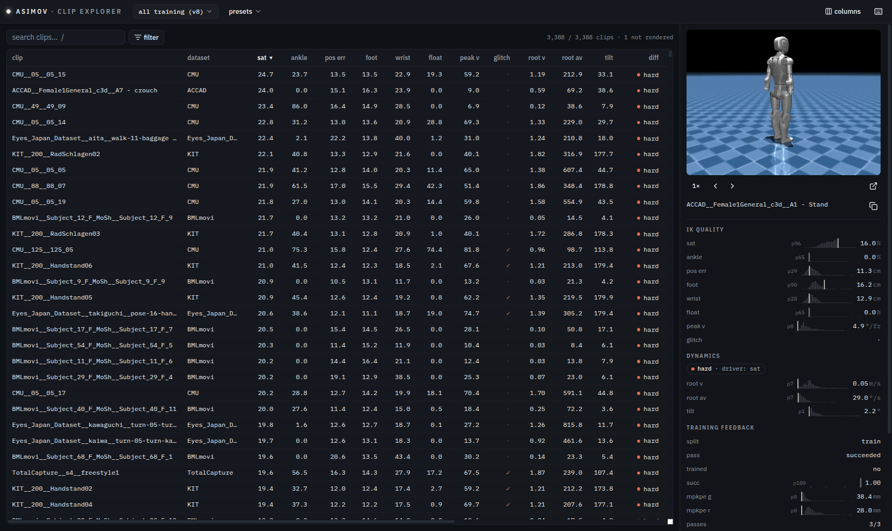

# Asimov GMR

Turn [AMASS](https://amass.is.tue.mpg.de/) human motion capture into
physically-plausible reference motion for the **asimov** humanoid — retargeted,
quality-scored, difficulty-labelled, curated, and split for RL training.

One command takes your AMASS copy and the asimov robot description and
reproduces our published release exactly:

```bash
asimov-gmr run --amass /path/to/AMASS --robot /path/to/asimov-1 --out ./out --verify
```

The IK engine is [GMR](https://github.com/YanjieZe/GMR); everything around it —
anatomy fixes, grounding, QA, difficulty, curation, the split, and the review UI
— is what this project adds. See [What this project adds](#what-this-project-adds).

> **Data licensing, up front.** This repository contains **code only**. AMASS and
> the SMPL-X body models are non-commercial research licenses and **cannot be
> redistributed** — including motion derived from them. You download them
> yourself; the retargeted output stays yours. See [THIRD_PARTY.md](THIRD_PARTY.md).

---

## What you need

| | | |
|---|---|---|
| **AMASS** (SMPL+H G) | register at [amass.is.tue.mpg.de](https://amass.is.tue.mpg.de/) | layout `<root>/<DATASET>/<subject>/<clip>_poses.npz` |
| **SMPL-X body models** | register at [smpl-x.is.tue.mpg.de](https://smpl-x.is.tue.mpg.de/) | `SMPLX_{NEUTRAL,MALE,FEMALE}.npz` → `assets/body_models/smplx/` |
| **asimov description** | [`menloresearch/asimov-1`](https://github.com/menloresearch/asimov-1) | clone it; `--robot`, `$ASIMOV_ROBOT_DIR`, or a sibling checkout |

## Install

```bash
git clone https://github.com/rsamf/asimov-gmr && cd asimov-gmr
git clone https://github.com/menloresearch/asimov-1 ../asimov-1   # or set ASIMOV_ROBOT_DIR
python -m venv .venv && .venv/bin/pip install -e .
.venv/bin/python scripts/fetch_smplx_models.py    # prints what to download, verifies placement
```

## Run

```bash
asimov-gmr run --amass $AMASS --out ./out            # the full pipeline
asimov-gmr run --amass $AMASS --out ./out --verify   # ...and check it matches the release
asimov-gmr run --amass $AMASS --out ./out --videos   # ...and render review MP4s
asimov-gmr run --amass $AMASS --out ./out --stage retarget --dry-run
```

Stages, all resumable, each also runnable standalone:

```
retarget → metrics → difficulty → compile → fallen → merge → recompile → [videos]
```

| stage | produces |
|---|---|
| `retarget` | `out/retargeted/**.pkl` + `manifest.json` (25-DOF, native fps, grounded) |
| `metrics` | per-clip airborne % and pelvis-relative IK residuals |
| `difficulty` | `easy`/`medium`/`hard` from five frozen factors |
| `compile` | `out/train/*.npz` — 23 actuated joints, 30 fps, wxyz — plus `compile_summary.json` |
| `fallen` | flags references that already trip the training env's fall check |
| `merge` | unions the human reject list with the fallen list |
| `recompile` | final training set, stamped with difficulty and train/test split |
| `videos` | small MP4 per clip for the review UI |

Then browse it:

```bash
cd clip_explorer/frontend && npm install && npm run build && cd ../..
ROBOTICS_ROOT=./out .venv/bin/python clip_explorer/app.py   # localhost:5001
```

## Reproducibility

The curation decisions are **in the repo**, not on someone's disk — that is what
makes "the same results" checkable:

| file | what it pins |
|---|---|
| `curation/clips.txt` | the exact source clips of the reference release |
| `curation/rejects.json` | every manually rejected clip |
| `curation/test_split.json` | the frozen 60/60/60 held-out test set |
| `curation/expected.json` | the counts `--verify` checks against |

Frozen thresholds (difficulty cutoffs, glitch detector, fall check, framerate
corrections) live in code with the measurement that set them. Re-run
`--verify` and any drift means a different AMASS snapshot, a modified IK config,
or an edited curation list — not luck.

### The reference release

| | |
|---|---|
| source clips | 3,388 |
| retargeted | 3,257 clean · 130 glitch · 1 timeout |
| **training set** | **3,221 clips · 8.50 h · 30 fps** |
| difficulty | 807 easy · 1,702 medium · 712 hard |
| split | 3,041 train · 180 test (60/60/60) |

---

## What this project adds

Upstream GMR provides the mink/MuJoCo IK solver. This project turns it into a
dataset pipeline for one robot. The long-form write-up — what was tried, what was
measured, and what was rejected — is in
[`docs/asimov_retargeting_report.md`](docs/asimov_retargeting_report.md).

### Retargeting fidelity

- **Torso hinges at the hips.** A naive spine3 target makes the robot curl its
  lumbar and shrink its trunk ~26% during a bend. Here the torso tilt targets the
  hip-centre→spine3 **chord**, and the base rides that chord at rigid radii
  calibrated at the clip's most upright frame — so the pelvis and torso swing
  about the hips like an actual body.
- **Upper body decoupled from the base solve.** Arm targets were dragging the
  floating base upward — a 1.73 m human reaching overhead lifted the 1.30 m robot
  ~55 cm off the floor. Arms now solve with the base velocity locked, so the base
  tracks the human pelvis (~9 cm) instead of floating.
- **Arms position-tracked, orientation free.** Inherited orientation tracking cost
  24.6 cm of wrist error and saturated the elbows; unreachable targets now stay
  unreached instead of distorting the whole pose.
- **Partial foot levelling (α = 0.4).** Human foot pitch/roll is shrunk toward
  level while heading is preserved. A constant config offset cannot cancel a
  *variable* tilt; full levelling kills kick articulation.
- **Contact-gated grounding.** The robot is grounded on its exact lowest geometry
  (mesh vertices and collision-sphere extents), only on frames where the human
  foot is actually in contact, with EMA smoothing and a raise-only clearance
  clamp — so jumps and running flight stay airborne. Adapted from PBHC
  ([KungfuBot](https://arxiv.org/abs/2506.12851)).
- **Subject height normalization.** Height is *measured* from a T-pose of each
  clip's own body model rather than guessed from a shape coefficient, and the
  scale ratio is inverted relative to upstream — the old direction made target
  size scale with height², shrinking short subjects quadratically.

### Source-data correctness

- **SMPL+H adapter.** AMASS ships SMPL+H, not SMPL-X; the adapter slices the
  shared body tree so both feed one pipeline.
- **Per-dataset framerate corrections.** AMASS stamps BMLhandball at 120 Hz, but
  the source publication captured at 240 — every clip in it plays at half speed.
  Confirmed by fitting gravity through ballistic pelvis arcs (apparent −1.4 m/s²
  where physics demands −9.81) and by expert throwers reading *slower* than lay
  ones. Corrected at load.

### Per-clip evaluation

Joint-limit and ankle-roll saturation · pelvis-relative IK residuals (all
bodies / feet / wrists) · airborne fraction · an IK-discontinuity detector that
quarantines glitched clips · a filter for references that already trip the
training environment's fall condition.

### Difficulty labelling

Every clip is `easy`/`medium`/`hard` — the **worst of five factors**: peak joint
velocity, root linear speed, root angular speed, joint saturation, and maximum
pelvis tilt. Cutoffs are frozen at corpus p75/p95 so labels stay comparable
across releases, and the responsible factor is recorded per clip.

*Externally validated:* in a real training run, policy failure rate rose
**7% → 20% → 52%** across easy → medium → hard.

### Curation

Motions this simulation cannot represent honestly are excluded, by rule and by
review:

- **Needs props or structures that don't exist in the sim** — sitting on chairs,
  benches and vaults, balance beams, ramps and stair climbs, treadmills (feet
  skate ~49 cm/s by construction), skiing and skating.
- **Degenerate or harmful as a humanoid reference** — lying down, cartwheels and
  handstands, extreme crouches, and anything whose reference pose already
  satisfies the environment's fall condition.

### Standardized split

A frozen, difficulty-balanced held-out set — 60 easy + 60 medium + 60 hard,
spread across AMASS collections — so the two training regimes (easy+medium, or
all three) evaluate on comparable data. Releases that drop a test clip leave a
reported hole rather than silently topping it up.

### Clip explorer

A review UI over the whole corpus: server-driven columns, faceted and
histogram-brush filters, multi-sort, shareable URL state, video playback, and a
`removed` column that explains why any clip is absent from the training set.



---

## License

MIT — see [LICENSE](LICENSE), with third-party notices in [NOTICE](NOTICE).
**The pipeline as a whole is constrained to non-commercial research** by AMASS,
SMPL-X, and the `smplx` package; see [THIRD_PARTY.md](THIRD_PARTY.md).

## Citation

This project builds directly on GMR — please cite it:

```bibtex
@software{ze2025gmr,
  title  = {General Motion Retargeting},
  author = {Yanjie Ze and João Pedro Araújo and Jiajun Wu and C. Karen Liu},
  year   = {2025},
  url    = {https://github.com/YanjieZe/GMR},
  note   = {GitHub repository}
}

@article{ze2025twist,
  title   = {TWIST: Teleoperated Whole-Body Imitation System},
  author  = {Yanjie Ze and Zixuan Chen and João Pedro Araújo and Zi-ang Cao and
             Xue Bin Peng and Jiajun Wu and C. Karen Liu},
  journal = {arXiv preprint arXiv:2505.02833},
  year    = {2025}
}
```

The contact-gated grounding follows PBHC:

```bibtex
@article{xie2025kungfubot,
  title   = {KungfuBot: Physics-Based Humanoid Whole-Body Control for Learning
             Highly-Dynamic Skills},
  author  = {Xie, Weiji and Han, Jinrui and Zheng, Jiakun and Li, Huanyu and
             Liu, Xinzhe and Shi, Jiyuan and Zhang, Weinan and Bai, Chenjia and
             Li, Xuelong},
  journal = {arXiv preprint arXiv:2506.12851},
  year    = {2025}
}
```

## Acknowledgements

IK on [mink](https://github.com/kevinzakka/mink) and
[MuJoCo](https://github.com/google-deepmind/mujoco); motion from
[AMASS](https://amass.is.tue.mpg.de/); body models from
[SMPL-X](https://smpl-x.is.tue.mpg.de/).
